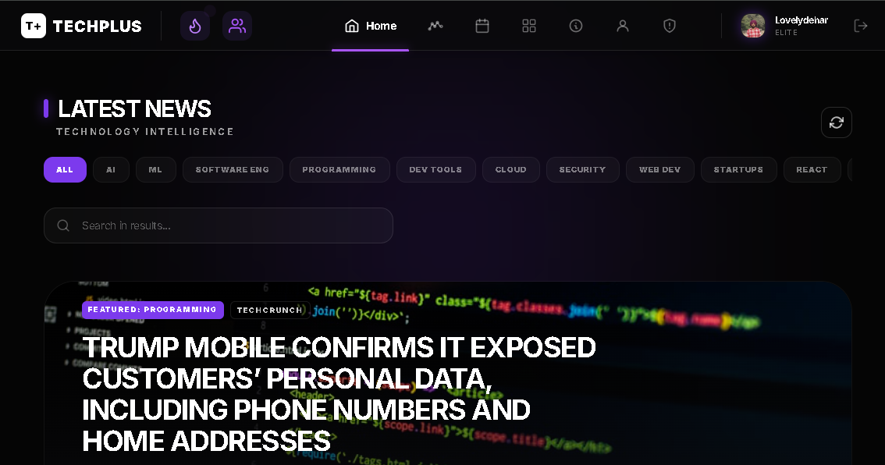
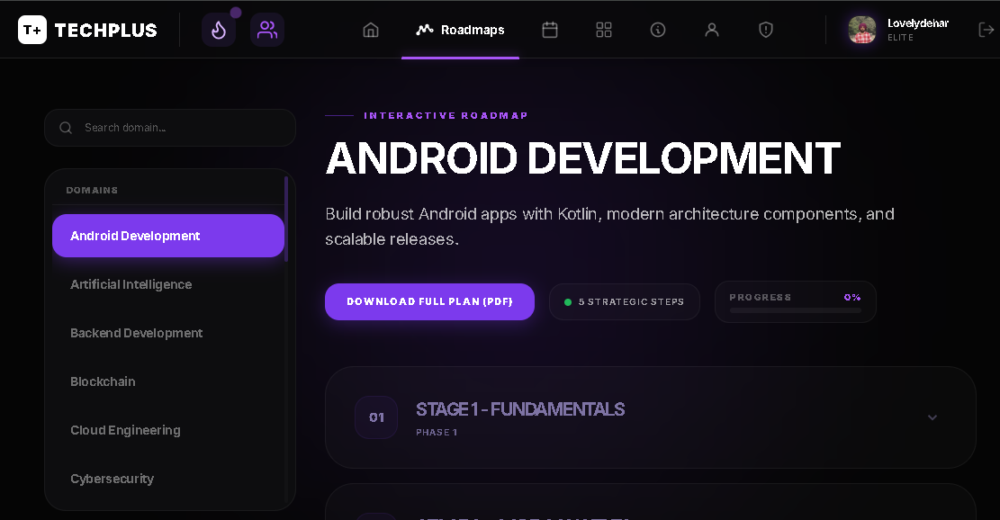
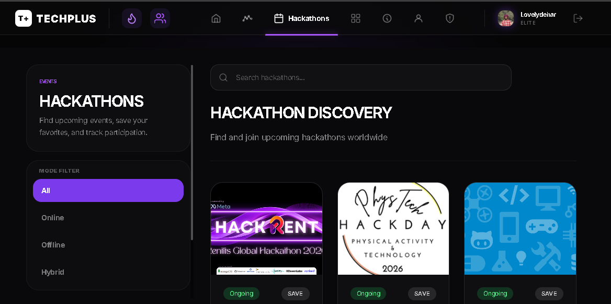
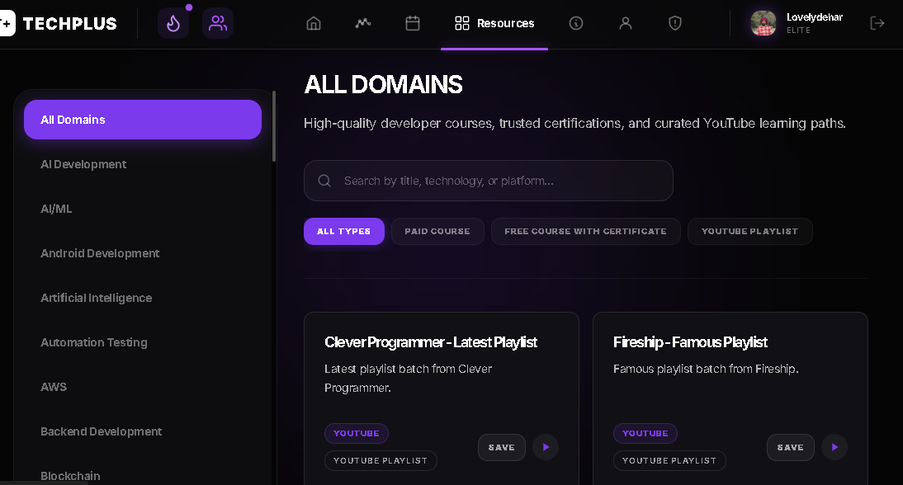
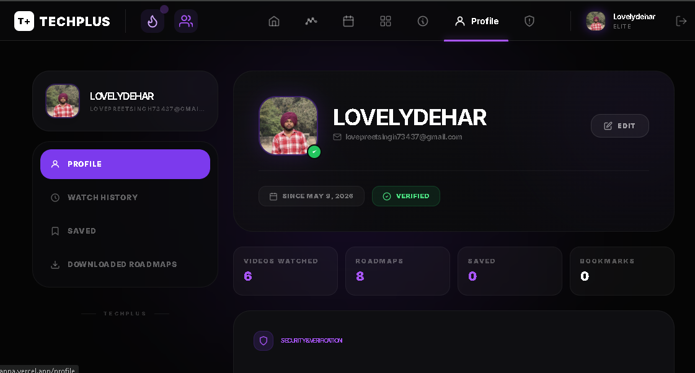
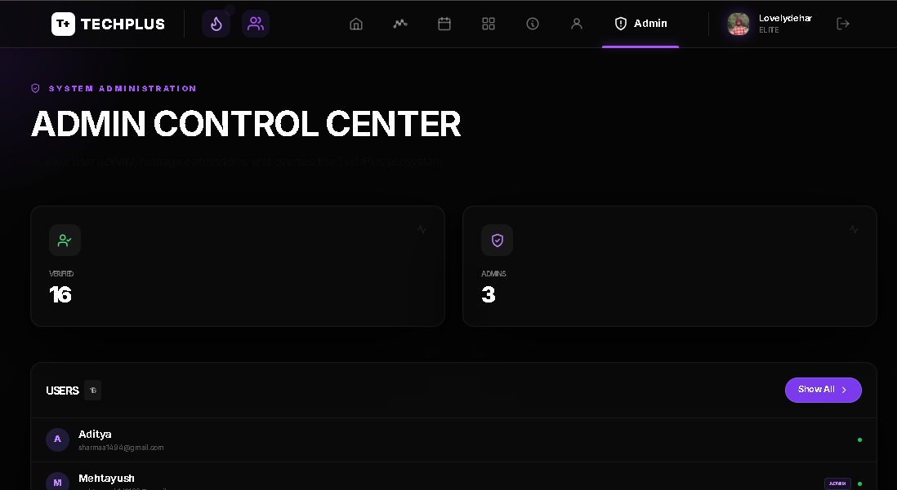

<div align="center">


# TechPlus

### The Developer Intelligence Platform

**Curated roadmaps · Live tech news · Hackathon discovery · Learning resources — all in one place**

[](https://tech-plus-kappa.vercel.app/)

<br/>


</div>

---

## What is TechPlus?

TechPlus is a full-stack developer platform built by developers, for developers. It solves a real problem: tech learners waste hours hunting across dozens of sites for roadmaps, news, hackathons, and courses. TechPlus brings it all into a single, beautifully designed dark-mode interface — with personalized profiles, bookmarks, admin controls, and real-time content.

> *"Built by developers who experienced the same struggles: missing opportunities, fragmented resources, and scattered information."*

---

## Screenshots

| Home — Latest News | Roadmaps | Hackathon Discovery |
|---|---|---|
|  |  |  |

| Resources Library | User Profile | Admin Panel |
|---|---|---|
|  |  |  |

---

## Core Features

### 📰 Tech News Feed
Live tech intelligence aggregated from sources like TechCrunch. Filter by category (AI, ML, Cloud, Security, Web Dev, React, and more), search within results, and read full articles — all from one dashboard.

### 🗺️ Learning Roadmaps
Structured, multi-stage career roadmaps across 25+ domains including Full Stack, Data Analytics, AI/ML, DevOps, Blockchain, and Cybersecurity. Each roadmap is broken into phases (Fundamentals → Core Concepts → Tools → Real Projects → Advanced Topics) with downloadable PDFs.

### 🏆 Hackathon Discovery
Browse, filter, and save upcoming hackathons worldwide. Filter by mode (Online / Offline / Hybrid), view event dates, and track saved events across sessions.

### 📚 Resource Library
High-quality developer courses, trusted certifications, and curated YouTube learning paths — organized by domain and type (Free, Paid, YouTube Playlist). Save resources for later.

### 👤 User Profiles
Personalized dashboards showing videos watched, roadmaps explored, saved content, and bookmarks. Includes security & verification status, auth provider info, and account tier (Elite badge).

### 🔐 Auth System
JWT-based authentication with email OTP verification. Supports password reset flow, session persistence via cookies, and role-based access (User / Admin).

### 🛡️ Admin Panel
Full admin dashboard to manage users (view, search, change roles, verify, delete), manage club events, hackathon listings, and platform content.

---

## Tech Stack

### Frontend
| Technology | Purpose |
|---|---|
| React 18 + Vite | UI framework and blazing-fast build tool |
| TailwindCSS | Utility-first styling |
| React Router v6 | Client-side routing |
| Context API | Global state (Auth, Dark Mode, Toast) |
| Axios | HTTP client with interceptors |

### Backend
| Technology | Purpose |
|---|---|
| Node.js + Express | REST API server |
| MongoDB + Mongoose | Database and ODM |
| JWT | Stateless authentication |
| Nodemailer | OTP email delivery |
| node-cron | Scheduled hackathon sync |
| express-rate-limit | API rate limiting |

### Infrastructure
| Service | Role |
|---|---|
| Vercel | Frontend hosting (auto-deploy from `client/`) |
| Render | Backend hosting (auto-deploy from `server/`) |
| MongoDB Atlas | Cloud database |

---

## Project Structure

```
TechPlus/
├── client/                          # React + Vite frontend
│   ├── public/
│   │   └── pdfs/                    # 25+ roadmap PDFs
│   ├── src/
│   │   ├── components/              # Reusable UI components
│   │   │   ├── Navbar.jsx
│   │   │   ├── Layout.jsx
│   │   │   ├── NewsSidebar.jsx
│   │   │   ├── SplashScreen.jsx
│   │   │   ├── Toast.jsx
│   │   │   ├── ClubsPanel.jsx
│   │   │   ├── ClubEventManager.jsx
│   │   │   └── CollegeHackathonManager.jsx
│   │   ├── pages/                   # Route-level page components
│   │   │   ├── Dashboard.jsx        # Home / news feed
│   │   │   ├── Roadmaps.jsx
│   │   │   ├── RoadmapDetail.jsx
│   │   │   ├── Hackathons.jsx
│   │   │   ├── Resources.jsx
│   │   │   ├── Profile.jsx
│   │   │   ├── AdminPanel.jsx
│   │   │   ├── AllUsers.jsx
│   │   │   ├── Bookmarks.jsx
│   │   │   ├── Login.jsx
│   │   │   └── ...
│   │   ├── context/                 # React Context providers
│   │   │   ├── AuthContext.jsx
│   │   │   ├── DarkModeContext.jsx
│   │   │   └── ToastContext.jsx
│   │   ├── services/
│   │   │   └── cacheService.js
│   │   ├── config/
│   │   │   ├── api.js
│   │   │   └── newsDomains.js
│   │   └── data/
│   │       ├── roadmapData.js
│   │       └── updates.js
│   ├── vite.config.js
│   ├── tailwind.config.js
│   └── vercel.json
│
└── server/                          # Node.js + Express backend
    ├── controllers/
    │   ├── authController.js
    │   ├── userController.js
    │   ├── newsController.js
    │   ├── roadmapController.js
    │   ├── hackathonController.js
    │   ├── clubController.js
    │   └── playlistController.js
    ├── models/
    │   ├── userModel.js
    │   ├── hackathonModel.js
    │   ├── newsModel.js
    │   ├── roadmapModel.js
    │   ├── clubModel.js
    │   ├── clubEventModel.js
    │   ├── bookmarkModel.js
    │   ├── playlistModel.js
    │   └── playlistVideoModel.js
    ├── routes/
    │   ├── authRoute.js
    │   ├── userRoute.js
    │   ├── newsRoute.js
    │   ├── roadmapRoute.js
    │   ├── hackathonRoute.js
    │   ├── clubRoute.js
    │   ├── playlistRoute.js
    │   └── adminRoute.js
    ├── middleware/
    │   ├── authMiddleware.js
    │   ├── adminMiddleware.js
    │   └── rateLimiter.js
    ├── services/
    │   ├── newsService.js
    │   ├── hackathonService.js
    │   ├── youtubePlaylistService.js
    │   ├── cacheService.js
    │   ├── roadmapSeedService.js
    │   └── playlistCatalogSeed.js
    ├── cron/
    │   └── hackathonSync.js
    ├── emailVerify/
    │   └── sendOtp.js
    ├── database/
    │   └── db.js
    ├── utils/
    │   ├── adminEmails.js
    │   ├── cookies.js
    │   └── emailEnv.js
    └── server.js
```

---

## Getting Started

### Prerequisites

- Node.js v18 or higher
- MongoDB Atlas account (free tier works)
- Gmail account with App Password enabled (for OTP emails)
- Git

### 1. Clone the repository

```bash
git clone https://github.com/Lovelydehar3/techplus.git
cd techplus
```

### 2. Set up the backend

```bash
cd server
npm install
```

Create `server/.env`:

```env
PORT=5000
NODE_ENV=development

# MongoDB
MONGO_URI=mongodb+srv://<username>:<password>@cluster.mongodb.net/techplus

# JWT
JWT_SECRET=your_super_secret_key_here
JWT_EXPIRES_IN=7d

# CORS
CLIENT_URL=http://localhost:5173

# Email (OTP)
EMAIL=your-gmail@gmail.com
EMAIL_PASS=your-gmail-app-password
```

> To get `EMAIL_PASS`: Google Account → Security → 2-Step Verification → App Passwords → Generate

```bash
npm run dev
# Server running at http://localhost:5000
```

### 3. Set up the frontend

```bash
# In a new terminal
cd client
npm install
```

Create `client/.env.local`:

```env
VITE_API_URL=http://localhost:5000
```

```bash
npm run dev
# Frontend running at http://localhost:5173
```

---

## API Reference

### Authentication
```
POST   /api/auth/register          Register new user
POST   /api/auth/login             Login with email/password
POST   /api/auth/verify-otp        Verify email OTP
POST   /api/auth/resend-otp        Resend OTP
POST   /api/auth/forgot-password   Trigger password reset
POST   /api/auth/reset-password    Reset with token
POST   /api/auth/logout            Clear session
```

### Users
```
GET    /api/user/profile           Get current user profile
PUT    /api/user/update            Update profile
GET    /api/user/bookmarks         Get saved bookmarks
POST   /api/user/bookmarks         Add bookmark
DELETE /api/user/bookmarks/:id     Remove bookmark
```

### Roadmaps
```
GET    /api/roadmaps               Get all roadmaps
GET    /api/roadmaps/:slug         Get roadmap by slug
```

### Hackathons
```
GET    /api/hackathons             Get all hackathons (with filters)
POST   /api/hackathons/save        Save a hackathon
DELETE /api/hackathons/save/:id    Unsave hackathon
```

### News
```
GET    /api/news/all               Fetch latest news (cached)
GET    /api/news/search?q=         Search news
```

### Playlists / Resources
```
GET    /api/playlists              Get all playlists
GET    /api/playlists/:domain      Get playlists by domain
```

### Admin (requires admin role)
```
GET    /api/admin/users            List all users
PUT    /api/admin/users/:id/role   Change user role
DELETE /api/admin/users/:id        Delete user
GET    /api/admin/stats            Platform stats
```

---

## Deployment

### Backend → Render

1. Go to [render.com](https://render.com) → New Web Service
2. Connect your GitHub repo
3. Set **Root Directory** to `server`
4. Build command: `npm install`
5. Start command: `node server.js`
6. Add all environment variables from `server/.env`
7. Deploy — note your Render URL (e.g. `https://techplus-api.onrender.com`)

### Frontend → Vercel

1. Go to [vercel.com](https://vercel.com) → New Project
2. Import your GitHub repo
3. Set **Root Directory** to `client`
4. Add environment variable: `VITE_API_URL=https://techplus-api.onrender.com`
5. Deploy

> After deploying, update `CLIENT_URL` in your Render env vars to your Vercel URL.

---

## Environment Variables Reference

| Variable | Location | Description |
|---|---|---|
| `PORT` | server | Express server port (default 5000) |
| `NODE_ENV` | server | `development` or `production` |
| `MONGO_URI` | server | MongoDB Atlas connection string |
| `JWT_SECRET` | server | Secret key for signing JWTs |
| `JWT_EXPIRES_IN` | server | Token expiry (e.g. `7d`) |
| `CLIENT_URL` | server | Frontend URL for CORS |
| `EMAIL` | server | Gmail address for OTP sending |
| `EMAIL_PASS` | server | Gmail App Password |
| `VITE_API_URL` | client | Backend base URL |

---

## Contributing

Contributions are welcome! Here's how to get started:

```bash
# 1. Fork the repo on GitHub

# 2. Clone your fork
git clone https://github.com/your-username/techplus.git

# 3. Create a feature branch
git checkout -b feature/your-feature-name

# 4. Make your changes, then commit
git add .
git commit -m "feat: add your feature description"

# 5. Push and open a Pull Request
git push origin feature/your-feature-name
```

Please follow conventional commit messages (`feat:`, `fix:`, `docs:`, `refactor:`).

---

## Built By

<table>
<tr>
<td align="center" width="50%">
<br/>
<b>Lovepreet Singh</b><br/>
Co-Founder & Full Stack Developer<br/>
<i>Scalable web apps · UI engineering · Developer tools</i><br/><br/>
<code>MERN</code> <code>React</code> <code>Node</code> <code>UI/UX</code> <code>Data</code><br/><br/>
<a href="https://github.com/Lovelydehar3">GitHub</a> ·
<a href="https://www.linkedin.com/in/lovepreet-singh-6200a8287/">LinkedIn</a> ·
<a href="mailto:lovepreetsingh73437@gmail.com">Email</a>
</td>
<td align="center" width="50%">
<br/>
<b>Karan Sharma</b><br/>
Co-Founder & Full Stack Developer<br/>
<i>Reliable developer experiences · Technical systems</i><br/><br/>
<code>Backend Systems</code> <code>API Architecture</code> <code>Platform Engineering</code><br/><br/>
<a href="https://github.com/KARAN-SHARXA">GitHub</a> ·
<a href="https://www.linkedin.com/in/karan-sharma-ji/">LinkedIn</a> ·
<a href="mailto:karansharma202005@gmail.com">Email</a>
</td>
</tr>
</table>

---

## License

MIT © 2026 TechPlus — Lovepreet Singh & Karan Sharma

---

## Support & Links

| Resource | Link |
|---|---|
| 🌐 Live App | [tech-plus-kappa.vercel.app](https://tech-plus-kappa.vercel.app/) |
| 📧 Contact | lovepreetsingh73437@gmail.com |
| 📧 Contact | karanshrama202005@gmail.com |

---

<div align="center">

**If TechPlus helped you, please consider giving it a ⭐ on GitHub — it means a lot to us!**

*Built with ❤️ in India*

</div>
